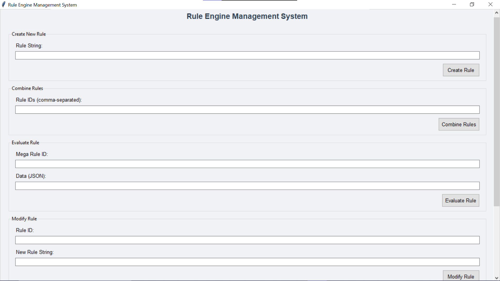
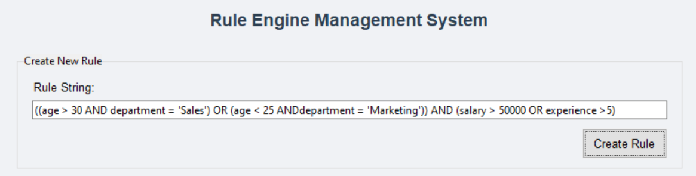
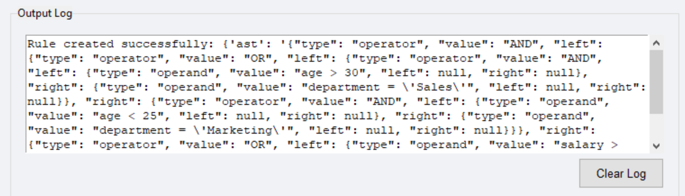
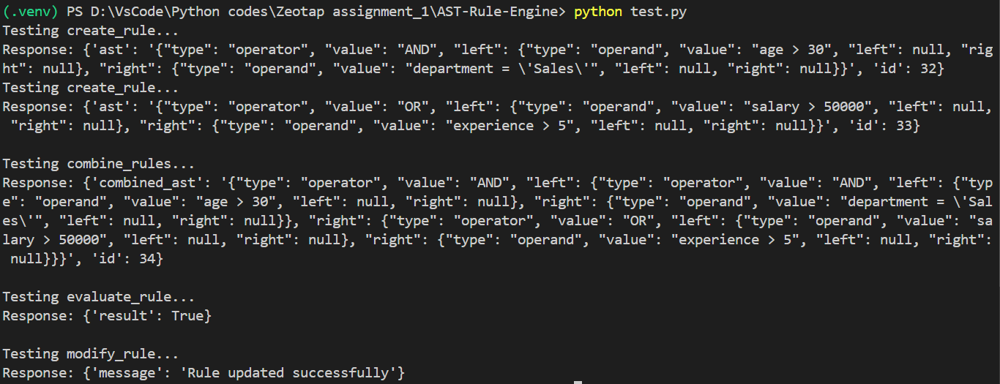

# Rule Engine with AST

This project implements a simple 3-tier rule engine application using Flask, SQLAlchemy, and SQLite. It allows for the creation, combination, and evaluation of rules based on Abstract Syntax Trees (ASTs).

## Setup

1. Install the required dependencies:
   ```bash
   pip install flask sqlalchemy

Run the Flask application:
bash
python main.py

**COMPONENTS**

1. Backend :  main.py (Flask Python SQLAlchemy)
2. Frontend : rlg.py (Tkinter UI Python)
3. Automated test script : test.py (Automatically test the app) (requests)


**APP COMPONENTS**

1. CREATE RULE : will create a rule and show id in UI. for eg: you create two rules it will create two rules with id 1 and 2
2. Combine RULE: for eg : you add rule number id with comma separated format, it will create a mega rule with separate id on the tkinteR UI
3. EVALUATE RULE : Add the mega rule Id and data params that you need to provide in json format


**API Endpoints**

1. Create Rule
URL: /create_rule
Method: POST
Data Params:
json
{
  "rule_string": "(age > 30 AND department = 'Sales') OR (salary > 50000)"
}

Success Response:
json
{
  "id": 1,
  "ast": "..."
}

2. Combine Rules
URL: /combine_rules
Method: POST
Data Params:
json
{
  "rule_ids": [1, 2]
}

Success Response:
json
{
  "id": 3,
  "combined_ast": "..."
}

3. Evaluate Rule
URL: /evaluate_rule
Method: POST
Data Params:
json
{
  "rule_id": 3,
  "data": {
    "age": 35,
    "department": "Sales",
    "salary": 60000,
    "experience": 6
  }
}

Success Response:
json
{
  "result": true
}

4. Modify Rule
URL: /modify_rule
Method: POST
Data Params:
json
{
  "rule_id": 1,
  "new_rule_string": "age > 40 AND department = 'HR'"
}

Success Response:
json
{
  "message": "Rule updated successfully"
}

Sample Curl Workflow
Here's a step-by-step workflow using curl commands to test the rule engine:
Create the first rule:
bash
curl -X POST http://127.0.0.1:5000/create_rule -H "Content-Type: application/json" -d '{"rule_string": "(age > 30 AND department = '\''Sales'\'') OR (salary > 50000)"}'

Create the second rule:
bash
curl -X POST http://127.0.0.1:5000/create_rule -H "Content-Type: application/json" -d '{"rule_string": "experience > 5 AND department = '\''Marketing'\''"}'

Combine the rules (replace 1 and 2 with the actual rule IDs from steps 1 and 2):
bash
curl -X POST http://127.0.0.1:5000/combine_rules -H "Content-Type: application/json" -d '{"rule_ids": [1, 2]}'

Evaluate the combined rule (replace 3 with the actual combined rule ID from step 3):
bash
curl -X POST http://127.0.0.1:5000/evaluate_rule -H "Content-Type: application/json" -d '{
  "rule_id": 3,
  "data": {
    "age": 35,
    "department": "Sales",
    "salary": 60000,
    "experience": 6
  }
}'

Modify a rule (replace 1 with the actual rule ID you want to modify):
bash
curl -X POST http://127.0.0.1:5000/modify_rule -H "Content-Type: application/json" -d '{
  "rule_id": 1,
  "new_rule_string": "age > 40 AND department = '\''HR'\''"
}'

Testing
You can use the provided test.py script to test the rule engine functionality. Run it using:
bash
python test.py

This script will test creating rules, combining rules, evaluating rules, and modifying rules.
test.py Script

## Application Images






